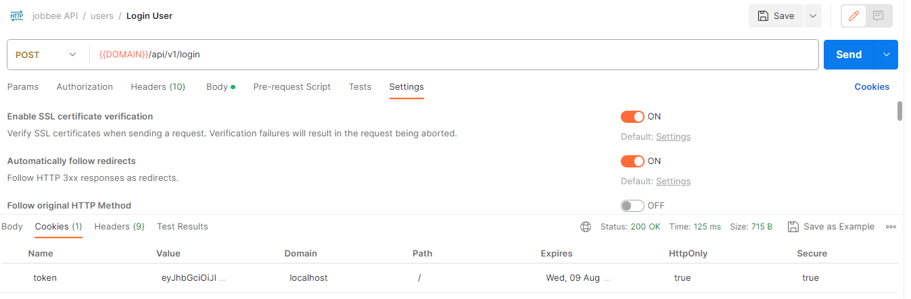
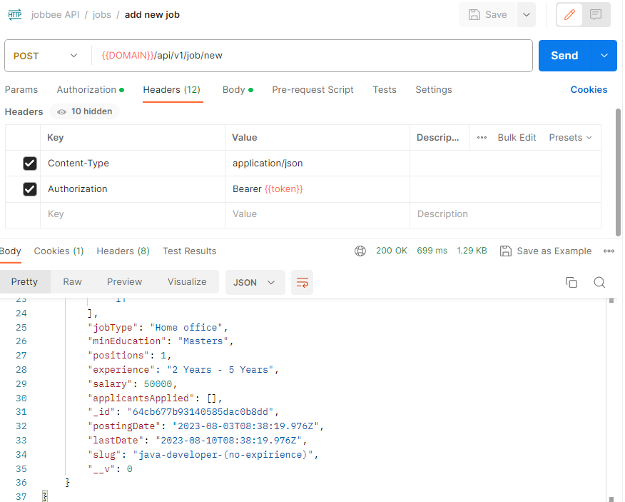

# jobbee API

## 58. Sending JWT Token in Cookie
HTTPS can be turned on in Postman

## 60. You have defined the variable {{token}} in Postman. Use them too!
`Tests => pm.environment.set("token", pm.environment.json().token`

